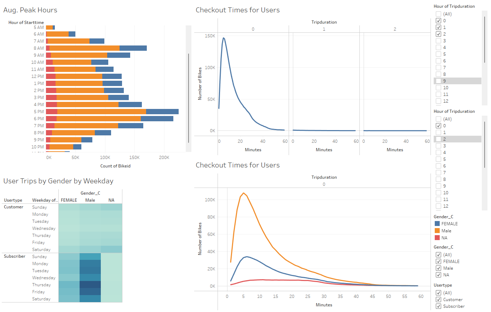
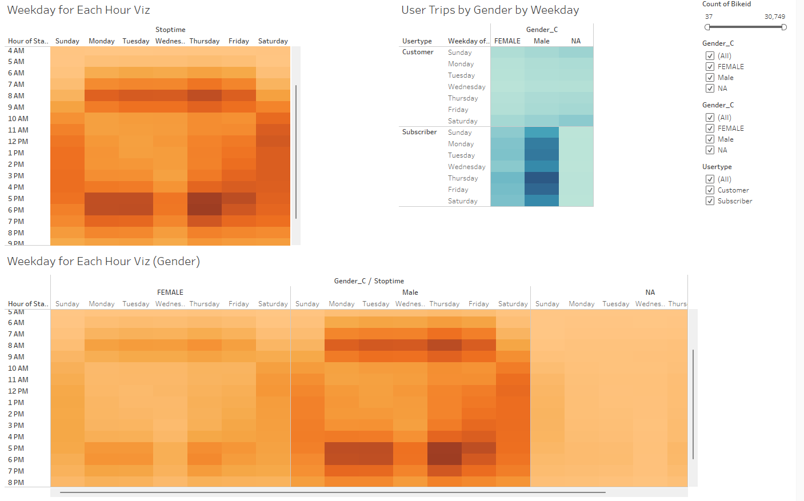
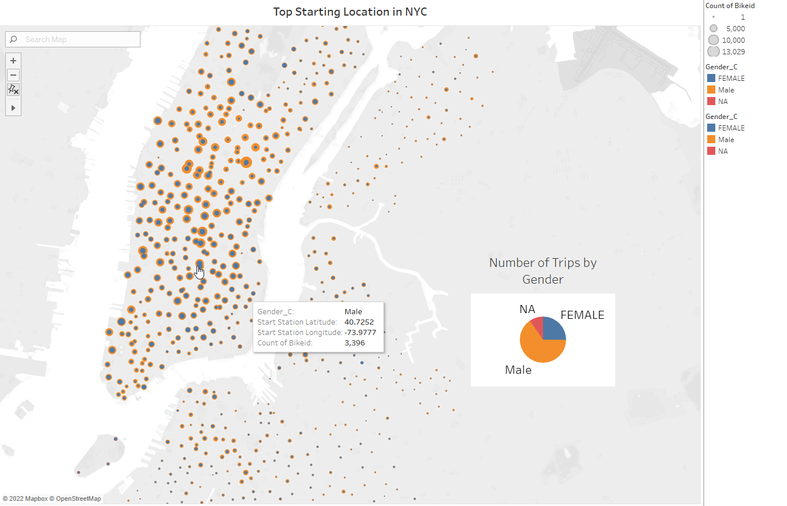

# Module 14 Challenge: bikesharing

## Overview of the Analysis
Goal is to analyze bike trip data in NYC in month of Aug. There is plenty of infomration that can be learned from this data such as how long a bike was used and which bikes are due for repair.  
In the challenge we are after the following:
* The length of time that bikes are checked out for all riders and genders
* The number of bike trips for all riders and genders for each hour of each day of the week
* The number of bike trips for each type of user and gender for each day of the week

In the next section, these information will be provided. The online dashboard can be found at: https://public.tableau.com/app/profile/jeff.modarres/viz/Module14_Challenge_16538794399490/NYCBIKEDATA

## Results

**Fig.1** shows 4 different plots. In the top right, it shows that most of the bike rentals end in less than 1 hour and it peaks around 5 minutes. Bottom right image shows that the majority of bikers are Men.
The Top left graph shows that bike rental peaks at 8AM and 5PM, the peak time for going to work and back home respectively. This graph also shows that most bikes are rented by men. 
In the bottom left plot, it shows qulitatively howmnay bikes are rented by user type and gender per weekdays. Most bikes are rented by subscribers and are male.

  
**Fig1. shows bike utilization per hour for different gender**  

  
**Fig.2** tells pretty much the same story. On weekdays, the highest number of bike rentals is around 8AM and 5/6PM. Weekends have somewhat opposite trend.  most bikes are rented  between 10AM and 4PM.  Same story is true  if we look at the data per gender. One thing to note is that more bikes are rented by Men. 

  
**Fig2. shows bike utilization per hour/gender**

**Fig.3** shows were most bikes are rented. Its also colored by gender.
  
**Fig3. shows bike utilization per hour/gender**

## Summary
In summary, most bike rentals are subscription based. Trip duration for rentals peaks around 5minutes and mostly end below one hour. 
More bikes are rented by Men. On weekdays, more bikes rented around 8AM and 5/6PM. On weekends, there is no early rental. Most rentals are between 10AM and 4PM. 

Extra Viz:
1- It would be interesting to see if a particular route has more customers per usertype.
2- it would be interesting how far bikes travels in different part of the city.
